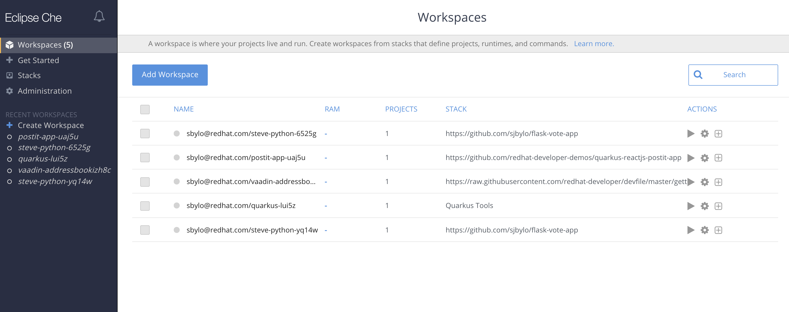
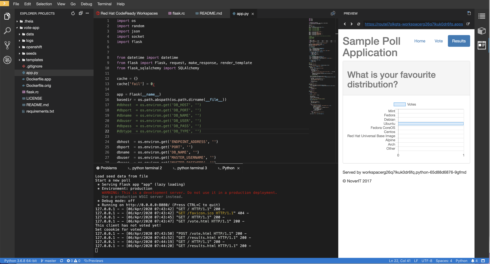

# CRW CodeReady Workspaces - Flask Vote app working - OCBC

For quick demo, go here: [https://che.openshift.io/dashboard/#/](https://che.openshift.io/dashboard/#/) - log in with your RH access login (or RH developer login)

You will see your Workspaces, if any:

Quick start:

1. Install the operator into a demo project

2. Install the Che cluster in the demo project

3. @ "CodeReady Workspaces Cluster Overview" click on the route - wait for Status: available

4. Install works into any project, e.g. "workspaces"

Good docs:  [https://www.eclipse.org/che/docs/che-7/introduction-to-eclipse-che/](https://www.eclipse.org/che/docs/che-7/introduction-to-eclipse-che/)

**

**

---

OCBC Demos - 17 Apr 2020

Use RHPDS to install 4.3 + CRW

==> [Video preso](https://my.allego.com/play.do?contentId=659233&sch=20921) <== for CRW messaging 

URLs:

[https://github.com/sjbylo/flask-vote-app](https://github.com/sjbylo/flask-vote-app)

[RBAC](https://access.redhat.com/documentation/en-us/red_hat_codeready_workspaces/1.2/html-single/administration_guide/index#permissions) - establish a security model - allow certain actions by assigning permissions to users. 

[Deck](https://docs.google.com/presentation/d/1WFRi9MZD3qksnEuAvgZpNrCjEf1PFLDMyxr-L2xThQA/edit#slide=id.g64798e8100_1_452) - [One slide](https://docs.google.com/presentation/d/1Zklf--RjGchYD6qJDcVR7BT_s-mGTaRTsxBJvVTuYEM/edit#slide=id.g6beb2c4044_0_235) - CRW [OneStop](https://redhat.highspot.com/items/5c7fd4a981171734ea321621#1)

[FAQ](https://docs.google.com/document/d/174USXEPCzTxz-piEk0CaOMzr2R1KhU7-1P7TEG0bBMc/edit#)

Others:

[videos](https://www.youtube.com/playlist?list=PLf3vm0UK6HKpBA8nWWO--6HtzKm6trH7-) (Veer M) 

[end-user doc](https://access.redhat.com/documentation/en-us/red_hat_codeready_workspaces/2.0/html-single/end-user_guide/index)[doc2.1](https://access.redhat.com/documentation/en-us/red_hat_codeready_workspaces/2.1/html/installation_guide/index) (May 2020)

Main [deck](https://docs.google.com/presentation/d/17EYvjLTE45B-nN__diBxnZCkKAMCKiaLWz6O5BO7vbw/edit#slide=id.g64798e8100_1_0)

Questions from OCBC: 

- What about other tools that devs need, e.g. Notepad++, postman ....?

- Can a developer install tools into the workspace?  What types of tools exactly? 

Also: How many devs to reach breakeven? 

---

My Demos

Demo 1 (Python example):

Open a workspace very quickly from a factory URL: 

URL to share the WS:

<workspaces URL>/f?url=[https://github.com/sjbylo/flask-vote-app](https://github.com/sjbylo/flask-vote-app)

E.g.

[https://codeready-workspaces.apps.cluster-ocbc-be70.ocbc-be70.example.opentlc.com/f?url=https://github.com/sjbylo/flask-vote-app](https://codeready-workspaces.apps.cluster-ocbc-be70.ocbc-be70.example.opentlc.com/f?url=https://github.com/sjbylo/flask-vote-app)

Demo 2:

Create a workspace from a devfile: 

[https://raw.githubusercontent.com/sjbylo/flask-vote-app/master/devfile.yaml](https://raw.githubusercontent.com/sjbylo/flask-vote-app/master/devfile.yaml)

Demo 3:

"node js and mongo" example works well. 

---

Example Devfile

metadata:

  name: wksp-idgi

projects:

  - name: vote-app

    source:

      location: '[https://github.com/sjbylo/flask-vote-app.git](https://github.com/sjbylo/flask-vote-app.git)'

      type: git

      branch: master

components:

  - id: ms-python/python/latest

    memoryLimit: 512Mi

    type: chePlugin

  - mountSources: true

    memoryLimit: 512Mi

    type: dockerimage

    alias: python

    image: 'registry.redhat.io/codeready-workspaces/stacks-python-rhel8:2.0'

apiVersion: 1.0.0
